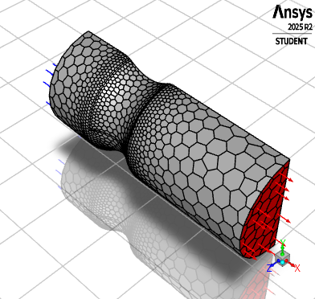
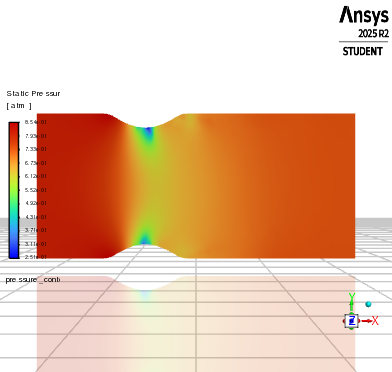
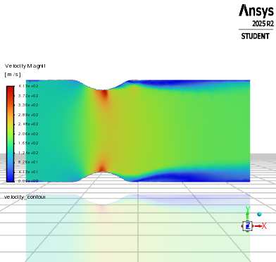

# TransientCompressible

C'est une ligne de code pour Faire démarrer ANSYS FLUENT avec Python et exécuter la simulation d'un écoulement co,pressible transitoire.


# Problème
La tuyère possède une hauteur d’entrée de 0,2 mètre et un profil lisse, sinusoïdal, qui réduit la section d’écoulement de 20 % au col, accélérant l’air jusqu’à des nombres de Mach élevés. Cette conception reproduit le fonctionnement des tuyères de moteurs à réaction, où la compression de l’écoulement génère la poussée. En raison de la symétrie géométrique et de la symétrie de l’écoulement par rapport au plan médian, seule la moitié du domaine est modélisée, ce qui réduit le coût de calcul tout en conservant une représentation précise du champ d’écoulement, y compris la formation des ondes de choc et la dynamique de pression.

<p align="center">
  
</p>

## Pyfluent guide

# Creez un environnement Virtuel env ou conda 
```bash
python -m venv fluentenv
```

# Installez Pyfluent

```bash
pip install ansys-fluent-core
```

# Aperçu
<p align="center">
  
  
  
</p>
